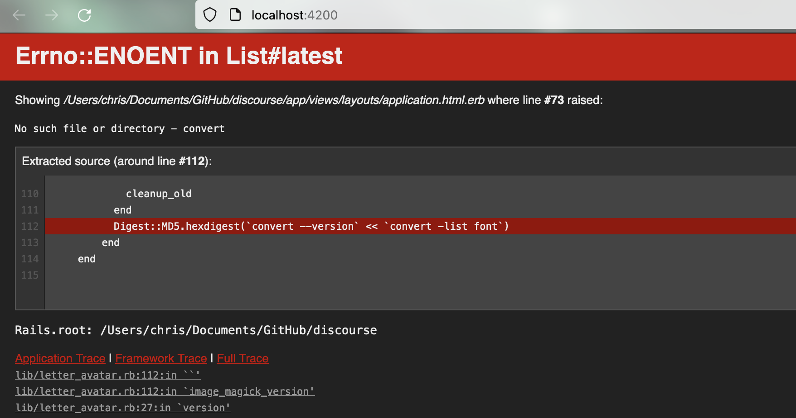

## Introduction
So, most of the install instructions are correct, but there are a few extra steps I had to figure out. I will go through the steps to install Discourse on Mac OS.

## Prerequisites
You need to have the following installed:
- Homebrew
- Redis
- PostgreSQL
- Ruby
- Bundler
- Node.js
- Yarn
- Mailhog
- Sidekiq
- ImageMagick

This last one is not mentioned in the install instructions, but it is required. When running the ember app, it will fail if ImageMagick is not installed.



```zsh
brew install imagemagick
```

## Install Discourse
1. Clone the Discourse repository
2. Install the dependencies
3. Create the database
4. Start the server

For number 4, I have added a dev script that uses concurrently to run both the rails server and the ember server. This is not required, but it is convenient.

```json
# package.json
"scripts": {
  "dev": "concurrently \"bin/ember-cli server --environment=development\" \"RAILS_ENV=development bundle exec rails s\"",
  ...
}
```

## Conclusion
For me, this is the way. I got Discourse running on my Mac OS, and it only took a couple of shots of espresso and some shipleys donuts. I hope this helps you get your Discourse instance up and running. If you have any questions, feel free to reach out to me on [Mastodon](https://hachyderm.io/@blue_fenix).

Here's the command to run the dev script:

```zsh
yarn dev
```

I still prefer to run mailhog and sidekiq in separate terminal windows. There's just too much log noise with more than what was added to the dev script IMO.